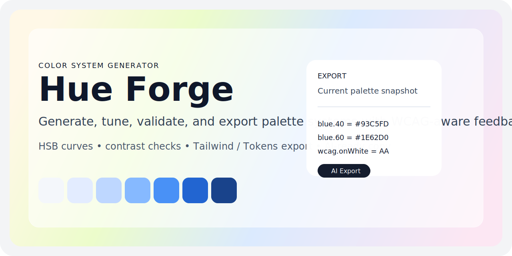

# Hue Forge



Hue Forge 是一个面向设计系统和品牌色板工作的颜色系统生成工具。它基于 HSB 曲线模型与 WCAG 对比度规则，帮助你生成、调整、检查并导出一整套可落地的色阶。

## 项目定位

- 面向需要快速生成多色相、多层级色板的设计与前端工作流
- 把“颜色生成、可读性检查、代码导出”收敛在同一个本地前端工具里
- 当前为纯前端单页应用，不依赖后端服务

## 核心能力

- 生成多色相色阶矩阵，并保持各列 step 结构对齐
- 调整 `Base Scale`、单列饱和度曲线和亮度曲线
- 同时查看黑字 / 白字对比度与 WCAG 等级
- 导出 `CSS`、`Tailwind`、`Tailwind 4`、`Tokens`
- 支持 `AI Export`，复制带上下文说明的结构化文本给 AI 使用

## 快速开始

1. 安装依赖：`npm install`
2. 启动开发环境：`npm run dev`
3. 打开浏览器访问：`http://localhost:3000`

## 常用命令

```bash
npm run dev
npm run build
npm run lint
npm run check:contrast
```

## GitHub Pages 部署

仓库已经补好 GitHub Pages 发布工作流。你只需要在 GitHub 仓库中完成一次设置：

1. 打开仓库 `Settings -> Pages`
2. 在 `Build and deployment` 中把 `Source` 切换为 `GitHub Actions`
3. 后续推送到 `main` 分支时会自动构建并发布

当前仓库的 Pages 地址应为：

```text
https://chenlicool.github.io/Hue-Forge/
```

## 使用流程

1. 在顶部工具栏选择或新增 hue 集合
2. 在左侧 `Base` 轨道调整整体亮度基线
3. 选中某个色条或 step，微调饱和度与亮度曲线
4. 观察右侧对比度反馈，确认文字可读性
5. 在导出面板复制对应格式，直接用于代码库或 AI 工作流

## 导出示例

Hue Forge 会基于当前画面中的 palette 直接生成导出结果，而不是维护另一套脱节的 token 状态。典型输出如下：

```css
:root {
  --blue-10: #f3f8ff;
  --blue-20: #dbeafe;
  --blue-30: #bfdbfe;
  --blue-40: #93c5fd;
}
```

```js
export default {
  theme: {
    extend: {
      colors: {
        blue: {
          10: "#f3f8ff",
          20: "#dbeafe",
          30: "#bfdbfe",
          40: "#93c5fd"
        }
      }
    }
  }
}
```

## 目录结构

- `src/`：前端源码
- `scripts/`：辅助脚本；当前包含颜色对比度检查脚本
- `archive/`：历史备份与遗留配置归档
- `ARCHITECTURE.md`：技术架构与核心流程说明
- `MEMORY.md`：按时间倒序记录影响面判断与执行约束
- `CHANGELOG.md`：版本变更记录

## 环境依赖

- Node.js 18+（更低版本兼容性待确认/未知）
- npm

## 当前状态

- 已完成根目录工程整理并推送到 GitHub
- 已补齐 GitHub Pages 发布配置；仓库设置中的 `Pages -> Source` 仍需手动切到 `GitHub Actions`
- 当前构建可通过，但生产包体积存在告警，后续可继续做 chunk 拆分
- `archive/metadata.json` 是否仍需长期保留，待确认/未知
